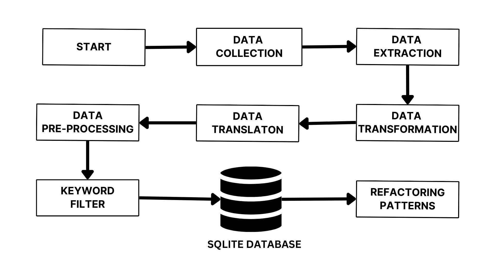

# DevGPT Pipeline

## Introduction

Welcome to the DevGPT Pipeline! This project extracts, processes, and analyzes data from the DevGPT repository through a streamlined pipeline.

## Pipeline Flow




## Pipeline Components

### 1. Data Extraction
- Download data from Zenodo.
- Organize data into designated folders.
- Extract diverse data types: Issues, Pull Requests, Discussions, Commits, Hacker News, Sharing, and Conversations.
- Hashing the text data to create unique IDs for each row. ( Since some data are duplicated since we are extracting from multiple snapshots of the repository hashing helps use create unique id based on the textual content of the row, if there is a change in the content of the row the hash will be different and hence we can identify the change in the content of the row. Ensuring that we are not double counting the data at the same time we are not missing any data. )

### 2. Data Parsing and Modeling
- Use a parser to extract and map data.
- Classify data into relevant tables: Issues, Pull Requests, Commits, Discussions, Hacker News, ChatGPT Sharing, and ChatGPT Conversation.
- Store data in an SQLite database.

### 3. Data Translation
- Detect non-English content.
- Translate non-English content into English.

### 4. Data Cleaning and Tokenization
- Implement comprehensive data cleaning using regex, nltk and Spacy.
- Convert text to lowercase and apply lemmatization.
- Store tokenized data in CSV files.

### 5. Keyword Searching and Dask Parallelization
- Optimize keyword searching with Dask parallelization.
- Process 60,000+ rows in under two hours.
- Identify successful matches bidirectionally.
- Store results in the database.

## Setup and Execution

1. **Docker and Docker Compose:**
    Ensure Docker and Docker Compose are installed on your machine.

2. **Run Docker Compose:**
   ```bash
   docker-compose up --build
   ```
    This will build the Docker image and run the pipeline. You can check the logs to see the progress of the pipeline.

3. To get the devgpt.sqlite file, run the following command:
   ```bash
   docker cp <container_id>:/app/devgpt.sqlite /path/on/local/machine
   ```
The container_id can be found by running `docker ps`.
Sample usage:
   ```bash
    docker cp devgpt-mining-controller-1:/app/devgpt.sqlite . 
   ```


## Note

Ensure a stable internet connection for dataset downloads from Zenodo.

